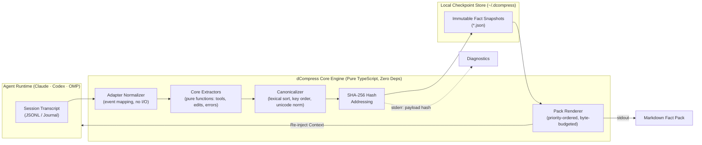

# dcompress

<p align="center">
  <b>Deterministic, rule-based memory for coding agents — no model in the extraction path.</b>
</p>

<p align="center">
  <a href="https://github.com/TomaszGonczar/dcompress/actions/workflows/ci.yml"></a>
  <a href="https://nodejs.org">=20"></a>
  <a href="package.json"></a>
  <a href="LICENSE"></a>
  <a href="docs/SCHEMA.md"></a>
</p>

<p align="center">
  <a href="REVIEWER_GUIDE.md"><b>Reviewer Guide (10 min)</b></a> ·
  <a href="#tldr">TL;DR</a> ·
  <a href="#try-it-in-60-seconds">Quickstart</a> ·
  <a href="#benchmarks">Benchmarks</a> ·
  <a href="#architecture">Architecture</a> ·
  <a href="#development">Development</a>
</p>

## TL;DR

`dcompress` turns a coding agent's raw JSONL transcript into a verifiable Markdown fact pack: files touched, commands run, errors raised and fixed, and decisions stated. Extraction uses zero LLM calls. The same transcript yields a byte-identical pack and SHA-256 hash on any machine, timezone, or locale.

- **704 tests, 0 runtime dependencies, MIT.** `npm test && npm run lint && npm run typecheck` run clean on Node 20 and 22, across Ubuntu and macOS.
- **Enforced determinism:** `test/determinism.spec.ts` re-runs fixtures under perturbed clock, locale, and `$HOME` settings. Non-deterministic payloads fail CI.
- **Preregistered benchmark:** [OG-86](docs/benchmark/og86-medium-v1/) evaluates 3 arms against the live Claude API using frozen protocols, rubrics, and checksummed inputs. On the initial complete run (`n = 1`, directional), the checkpoint pack recovered **14.5/100** points versus **12.0/100** for native compaction alone and **12.0/100** for host summary resurfacing.
- **Automated publication gates:** CI scans working tree and commit history for credential leaks (`scripts/privacy-scan.mjs`) and validates clean-clone reproducibility (`scripts/clean-clone-check.mjs`).
- **Scope boundaries:** Continuity commands are experimental and Claude-only. MCP servers, alternate adapters, and runtime secret redaction are not yet implemented.

Try it in 60 seconds ⬇, or jump to [How it works](#how-it-works) / [Determinism](#determinism) / [Benchmarks](#benchmarks).

## Try it in 60 seconds

Requires **Node 20 or newer** (`package.json` declares `engines.node >= 20`; CI runs 20 and
22) and npm. No account, no network at runtime, no configuration.

```sh
git clone https://github.com/TomaszGonczar/dcompress.git
cd dcompress
npm ci
npm run build
node dist/cli.js preview --transcript test/fixtures/claude/slice-0001/transcript.jsonl
```

The build step is required: nothing generates `dist/` for you, and `npm ci` does not link a
`dcompress` binary into the repository root. Run the CLI through `node dist/cli.js`.

Expected stdout — a Markdown pack, 1696 bytes for this fixture:

```text
## dcompress context [dcompress:1ebd2c27a646]
Status: ok
Facts: 9 | external: 0 | unmapped: 0 | coverage: 1000000 ppm
Source entries: 8 | tool calls: 7
```

and on stderr, the diagnostic report ending in the payload hash:

```text
payload hash: sha256:1ebd2c27a646e226e18229a76828f90e658795c30b8db22f23618777eaba16c4
```

Re-run it under a different timezone, locale, or `$HOME` and the pack and hash are identical.
[`docs/demo/claude-slice-0001.md`](docs/demo/claude-slice-0001.md) holds the full output with
checksums, and `test/demo.spec.ts` fails if that document drifts from what the CLI renders.
[`docs/demo/claude-continuity-0001.md`](docs/demo/claude-continuity-0001.md) is the stronger
artifact: the same kind of run carried across a compaction boundary, with checkpoint, injection,
and merge included.

Useful flags:

```text
node dist/cli.js preview --help
```

- `--include-evidence` appends the transcript line numbers backing each fact.
- `--max-bytes <n>` bounds the pack size (default 16384). A value too small to hold the
  mandatory header is refused with the exact minimum rather than failing internally.
- `--max-facts <n>` caps how many facts are rendered.
- `--json` prints the payload, the payload hash, per-tool-name coverage (which tool names, if
  any, account for a coverage gap), diagnostics, and degraded state as one JSON object, instead
  of the pack and the text report.

To run it against your own session, pass the `transcript_path` that Claude Code hands its
hooks, under `~/.claude/projects/<slug>/<session>.jsonl`. The command **never** scans for a
session or picks the most recent one: if you do not name a transcript, it refuses.

The experimental continuity slice uses the same explicit identity rule and a disposable,
task-owned store. After a Claude `PreCompact` payload is available, checkpoint and restore it:

```sh
node dist/cli.js snapshot --session <session-id> --transcript <path> --store <dir>
node dist/cli.js restore --session <session-id> --store <dir>
```

For a development hook bridge, pipe the Claude hook JSON to the matching command:

```sh
printf '%s\n' '<claude-hook-json>' | node dist/cli.js hook --event precompact --store <dir>
printf '%s\n' '<claude-hook-json>' | node dist/cli.js hook --event session-start --store <dir>
```

The hook fails open with `{}` on malformed input or an unavailable checkpoint. This slice is
Claude-only and task-owned; it does not edit live Claude configuration.

[`docs/demo/claude-continuity-0001.md`](docs/demo/claude-continuity-0001.md) records the whole
loop — checkpoint at the boundary, injection at `SessionStart`, checkpoint after the compaction,
and the merged pack — against a synthetic two-epoch fixture, pinned byte-for-byte by
`test/continuity-demo.spec.ts`. It also documents extraction boundaries: a next action stated in
prose is extracted only when it matches the decision-cue lexicon, `todo.state` keeps a task's text
but not whether it is open or done, and under a reduced byte budget the todo facts are the first
the renderer drops.

## What it does today, and what it does not

| Capability | Status |
|---|---|
| Map a Claude Code JSONL transcript to facts | **Works** |
| Extract `file.modified`, `file.read`, `cmd.run`, `cmd.failed`, `error.raised`, `error.fixed`, `decision.stated`, `todo.state` | **Works** |
| Pair tool calls to their results by ID, over non-adjacent lines | **Works** |
| Count unmapped tool calls and report coverage in parts-per-million | **Works** |
| Deterministic payload and payload hash | **Works** — the same transcript bytes *plus the same extraction inputs* yield the same canonical payload and the same hash, on any machine |
| Refuse rather than guess (no session scanning, no invented `cwd`) | **Works** |
| Byte/fact-budgeted pack with an elision notice | **Works** |
| Explicit-session durable checkpoint store | **Works — experimental Claude-only slice** |
| `restore` / bounded pack for the named session | **Works — experimental Claude-only slice** |
| Claude `PreCompact` / `SessionStart` hook bridge | **Works — Claude only.** `install` writes the real hook command into a live settings file; the checkpoint → compact → resume → inject loop itself is demonstrated only against an explicit session and a synthetic fixture ([`docs/demo/claude-continuity-0001.md`](docs/demo/claude-continuity-0001.md)), not yet inside a real Claude Code session |
| Store: XDG path resolution, atomic snapshot write, hash-verified read, quarantine, manifest, advisory lock, retention | **Works** — `src/store/`, exposed by `list`/`show`/`verify`/`doctor` and written by `prune`/`pin` (retention deletions and the pinned flag); it is a separate format from the continuity checkpoint store above, and no shipped command writes snapshots into it yet (only test code calls `writeSnapshot` directly) |
| `list` / `show` / `verify` / `doctor` (read-only store commands, `--json` supported) | **Works** — `verify --provenance` re-checks facts against the transcript named in the envelope; `doctor` reports the same store's manifest, lock, quarantine, and adapter coverage for one session |
| `prune` / `pin` | **Works** — `prune` applies the existing retention policy (15 snapshots or 72 h, newest and pinned exempt) to one explicitly named session and records each deletion in `manifest.json`; `--dry-run` reports the same set and deletes nothing. `pin`/`--unpin` sets or clears one snapshot's `pinned` flag through the manifest. Both require an explicit `--session`, and `--json` is supported |
| `install` / `uninstall --agent claude` | **Works — Claude only.** Writes or removes dcompress's hook entries in a settings.json inside a byte-marked managed region; every file it edits or creates is backed up first under `<store>/backups/`, and `uninstall` restores it byte-identical (`cmp`-verified in an automated test, D4) or removes a file dcompress created; `--dry-run` prints the plan without writing. Not yet exercised against a real Claude Code session and a real compaction (D2) |
| MCP server | **Not implemented** |
| Codex, OMP, Pi, or any second adapter | **Not implemented** |
| `doctor` | **Works** — reports store, manifest, lock, quarantine, and adapter coverage health for one explicitly named session; `--json` supported |
| `diff`, `init` | **Not implemented** |
| `git.state` facts for Claude | **Not implemented** — the core supports them, the Claude adapter does not emit them |
| Secret redaction | **Not implemented** — planned for the hardening phase |
| npm publish / `npm i -g dcompress` / `npx dcompress` | **Not available** — the package is `private: true` |
| Windows | **Not tested** — CI covers Ubuntu and macOS only |
Continuity commands operate under explicit constraints:
- **Scope:** Claude only. Requires explicit `--session`, `--transcript`, and `--store` paths.
- **Epochs:** `PreCompact` triggers a new injection epoch. Duplicate `SessionStart(compact)` deliveries within that epoch are suppressed; `SessionStart(resume)` always injects.
- **State union:** `restore` merges degraded states across the verified snapshot chain. Numeric attributes use deterministic `max` rather than cross-epoch sums.
- **Fact provenance:** Facts from earlier checkpoints remain historical (`unbacked`) unless re-observed in the newest checkpoint.
- **Lifecycle commands:** `install` and `uninstall` modify Claude configuration files inside marked boundaries, backed up to `<store>/backups/`. They remain unproven against live production sessions.

## How it works



- The adapter maps record shapes to normalized events. It never reads a clock, the filesystem,
  or the environment, so every value it emits comes from the transcript bytes.
- Extraction is a pure function `(events, config) → facts`. No model, no I/O, no `process.env`;
  a lint rule in the test suite enforces that `src/core/**` cannot import I/O.
- Canonicalization fixes key order, number form, Unicode normalization, and set ordering, so the
  same inputs produce the same bytes.
- The hash covers the canonical **payload only**. Clock, host, and transcript path live in an
  envelope that is not part of the artifact's identity — see
  [`docs/SCHEMA.md`](docs/SCHEMA.md) §6.1.
- The pack orders facts by priority (decisions, then errors and their fixes, then files, then
  commands), retains as many ordered facts as fit, and emits a visible elision notice.

## Determinism

Determinism is enforced directly in CI:

- **Zero LLM calls:** Pure TypeScript rules extract all facts ([ADR 002](docs/adr/002-rule-based-extraction-no-model.md)).
- **Canonical output:** The committed fixture renders to `sha256:1ebd2c27a646e226e18229a76828f90e658795c30b8db22f23618777eaba16c4` across perturbed `TZ`, `LANG`, `LC_ALL`, and `$HOME` on Node 20, 22, and 26. The hash covers transcript bytes plus declared extraction inputs (repo root, path base, extractor and canonicalization versions; see [SCHEMA.md](docs/SCHEMA.md) §6.1).
- **Regression vectors:** `test/determinism.spec.ts` executes all fixtures under perturbed clock and host variables. Any payload drift fails CI.

## Privacy

> **Read this before pointing it at a real session.** The facts dcompress prints carry short,
> bounded snippets of transcript text, and **secret redaction is not implemented yet**. Treat a
> generated pack as potentially sensitive: read it before pasting it anywhere. Nothing is
> uploaded — there is no network code in the runtime path — but a pack printed to your terminal
> can still contain a token, a path, or a private note that the transcript happened to contain.
> The bundled demo transcript is synthetic.

### Publishing this repository

Two automated gates must pass before publishing:
1. `scripts/privacy-scan.mjs` scans working tree and commit history for leaked secrets and paths.
2. `scripts/clean-clone-check.mjs` clones `HEAD` into an isolated temporary directory and reproduces the quickstart output byte-for-byte.

#### Privacy and history scan

CI runs `scripts/privacy-scan.mjs` as a dedicated `privacy` job:

```sh
node scripts/privacy-scan.mjs --json
node scripts/privacy-scan.mjs --history origin/main..HEAD --json
```

The scanner checks for host paths, UUIDs, bearer tokens, API key prefixes, email addresses, and the local host/user identity. Reports identify the rule, file, and line without printing matched secret text into logs. The `--history` flag scans additions in new commits so that deleted secrets are still caught. Unit tests in `test/privacy-scan.spec.ts` verify detection coverage.

Allowlist entries match specific test fixtures and sandbox paths with documented justifications.

#### Clean-clone reproduction

`scripts/clean-clone-check.mjs` verifies the quickstart sequence in a clean environment:

```sh
node scripts/clean-clone-check.mjs
node scripts/clean-clone-check.mjs --json
```

The script clones `HEAD` into a temporary directory (without network fetches), installs dependencies, builds `dist/`, runs the preview command, and checks stdout byte length (1696 bytes) and the stderr payload hash against the values declared in this README. Expected values are parsed directly from this document.

Exit codes: `0` reproduced, `1` output mismatch, `2` build or parse failure. CI runs this check in the `clean-clone` job on `ubuntu-latest`.

See [ADR 003](docs/adr/003-facts-not-transcripts.md) for data boundary decisions and [CONCEPT.md](docs/CONCEPT.md) §9 for the security model.

## Preview Evaluation & Limitations

The preview evaluates whether rule-based transcript extraction yields facts worth injecting into an agent context:

> **Premise supported, narrowly.** The preview carries information the agent's own compaction
> summary does not: an evidence-backed user decision, a normalized failure signature, an
> explicit error→fix linkage, merged edit history, omitted read and command activity,
> deterministic replay, and visible extraction health. This is enough to justify continuing.

The limitations, stated as plainly as the verdict:

1. The committed fixture is a **small, completed, synthetic task** — 7 tool calls, 9 facts. It
   is not a long real session.
2. **Most of its file changes are git-visible**, so its advantage over `git status` is not yet
   demonstrated at scale.
3. **No unfinished next action is exercised in the preview fixture** — the open-work case a
   post-compaction resume most needs. The continuity demo does carry an unresolved task across a
   compaction, and shows that the pack cannot say it is unresolved.
4. The repository includes an **experimental**, task-owned Claude continuity slice with explicit
   snapshot, restore, and hook commands, plus a Claude-only `install`/`uninstall` with
   byte-identical restore (verified by an automated `cmp` test). Neither replaces a live integration
   test: no recorded session shows a real compaction executing through an installed hook in production.
5. It measures whether the pack is *useful*, not whether injection improves agent outcomes. The
   three-arm continuity-fidelity test is reserved for a later phase
   ([`docs/DEVELOPMENT_PLAN.md`](docs/DEVELOPMENT_PLAN.md) §7.1).

## Roadmap

The design targets a tool that installs into an agent, snapshots automatically at compaction,
and restores a verified pack. This checkout has the experimental explicit-session Claude
continuity slice and a Claude-only `install`/`uninstall` that has not yet been proven against a
real Claude Code session; general, multi-agent installation and the other adapters remain future
work. In wave order:

1. **Wave 1 — done.** Core engine, canonicalization, hashing, 10 golden vectors.
2. **Wave 2 — done.** Adapter recon is complete, the Claude thin slice (`preview`) is
   implemented and judged above, and the store (snapshots, manifest, lock, retention) is
   implemented as a library.
3. **Wave 3 — in progress.** The experimental Claude continuity slice and a Claude-only
   `install`/`uninstall` with reversible, byte-identical restore are in place; verifying the loop
   inside a live Claude Code session during compaction is what remains.
4. **Wave 4.** Adapter framework, then the Codex and OMP adapters, each validated against the
   framework rather than the engine.
5. **Wave 5.** MCP server and the generic fallback tier are not started; a hook
   fault-injection suite (`test/hook-fault-injection.spec.ts`) already verifies recovery ahead of
   remaining hardening work (fuzzing, property tests, budget review), and release remains gated on the other waves.

## Design documents

- [`docs/CONCEPT.md`](docs/CONCEPT.md) — the problem, the architecture, the integration matrix,
  and an explicit list of what dcompress is not.
- [`docs/SCHEMA.md`](docs/SCHEMA.md) — **normative.** The snapshot format and the
  canonicalization rules that make hashes reproducible. If code and this document disagree,
  code is wrong.
- [`docs/DEVELOPMENT_PLAN.md`](docs/DEVELOPMENT_PLAN.md) — phases, wave gates, exit criteria,
  and the bug policy.
- [`docs/ADAPTER-SPEC.md`](docs/ADAPTER-SPEC.md) — per-agent integration contract, with an
  evidence marker on every claim.
- [`docs/adr/`](docs/adr) — the accepted decisions, including rule-based extraction, facts not
  transcripts, determinism as a release gate, and reversible install.

## Benchmarks

[`docs/benchmark/native-compaction-retention.md`](docs/benchmark/native-compaction-retention.md) records exploratory observations on context retention across repeated compaction cycles using synthetic event sets.

### OG-86 Benchmark

The [OG-86 benchmark](docs/benchmark/og86-medium-v1/) is a preregistered ([preregistration.md](docs/benchmark/og86-medium-v1/preregistration.md)), blinded 3-arm comparison executed against the live Claude API. It uses a frozen protocol, a frozen scoring rubric, and checksummed inputs (`checksums.sha256`).

The benchmark controllers (`scripts/benchmark/run-og86-medium.mjs` and `run-og86-stage0.mjs`) enforce runtime validity gates: model ID pinning, tool boundary verification, checkpoint hash re-derivation via `restore`, treatment accounting, and cost ceilings. Stop conditions and frozen artifacts are verified in `test/og86-controller.spec.ts` and `test/og86-benchmark.spec.ts`.

A complete, checksummed 3-arm run finished on 2026-09-16 ([results/](docs/benchmark/og86-medium-v1/results/)): zero invalidations, zero operational stops, with model ID and tool boundaries verified at every checkpoint.

The experiment evaluates whether a freshly resumed Claude 3.5 Haiku process recovers more verifiable work state across four manual `/compact` cycles under three treatments:
- **Arm A:** Native compaction only (control)
- **Arm B:** Native compaction plus re-surfaced host summary
- **Arm C:** Native compaction plus deterministic dcompact checkpoint pack

Cumulative recall at the fourth checkpoint, scored against a 100-point frozen rubric:

| Arm | Treatment | Points | Recall |
|---|---|---|---|
| A | native compaction only (control) | 12.0 / 100 | 12.0% |
| B | native compaction + re-surfaced native summary | 12.0 / 100 | 12.0% |
| C | native compaction + dcompact checkpoint pack | 14.5 / 100 | 14.5% |

**Scope of evidence:** This is directional evidence (`n = 1` per arm, one machine, one model, one workload). Arm C recovered 14.5 points compared to 12.0 points for Arms A and B. Re-surfacing the host's summary (Arm B) showed no measured gain over native compaction alone (Arm A).

Total series cost was $2.04 (Arm A: $0.61, Arm B: $0.66, Arm C: $0.76). Wall-clock runtimes: Arm A 10.9 min, Arm B 12.2 min, Arm C 13.1 min.

## Development

```sh
npm ci
npm test          # vitest: unit, golden vectors, determinism, dependency policy
npm run lint
npm run typecheck
npm run build     # emits dist/, the only shipped surface
```

Golden vectors are regenerated only through `npm run gen:vectors`, which writes `*.actual` for
human review. Never update an expected hash to make a test pass — investigate instead. See
[`AGENTS.md`](AGENTS.md) for the working rules and the ten non-negotiable invariants.

## License

MIT — see [`LICENSE`](LICENSE).
