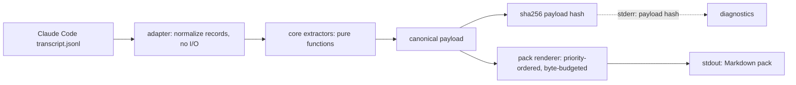

# dcompact

Deterministic, rule-based memory for coding agents — no model in the extraction path.

[](https://github.com/TomaszGonczar/dcompact/actions/workflows/ci.yml)

When a coding agent compacts, it replaces the older half of its own context with a few
paragraphs of model-written prose. `dcompact` takes the opposite approach: it reads the
agent's own transcript with deterministic rules and turns what actually happened — files
touched, commands run, errors raised and fixed, decisions stated — into a bounded,
hash-addressed fact pack that can be verified against the transcript line by line.

> **Status: work in progress — deterministic core plus Claude Code transcript preview.**
> Implemented and tested today: `dcompact preview --transcript <path>`, which maps a Claude
> Code JSONL transcript to facts and prints a bounded pack with a payload hash. **Not
> implemented:** any durable store, hooks, install/uninstall, restore or injection, MCP, and
> the Codex/OMP adapters. Those are the roadmap in
> [`docs/DEVELOPMENT_PLAN.md`](docs/DEVELOPMENT_PLAN.md), not features of this checkout.

## Try it in 60 seconds

Requires **Node 20 or newer** (`package.json` declares `engines.node >= 20`; CI runs 20 and
22) and npm. No account, no network at runtime, no configuration.

```sh
git clone https://github.com/TomaszGonczar/dcompact.git
cd dcompact
npm ci
npm run build
node dist/cli.js preview --transcript test/fixtures/claude/slice-0001/transcript.jsonl
```

The build step is required: nothing generates `dist/` for you, and `npm ci` does not link a
`dcompact` binary into the repository root. Run the CLI through `node dist/cli.js`.

Expected stdout — a Markdown pack, 1694 bytes for this fixture:

```text
## dcompact context [dcompact:1ebd2c27a646]
Status: ok
Facts: 9 | external: 0 | unmapped: 0 | coverage: 1000000 ppm
Source entries: 8 | tool calls: 7
```

and on stderr, the diagnostic report ending in the payload hash:

```text
payload hash: sha256:1ebd2c27a646e226e18229a76828f90e658795c30b8db22f23618777eaba16c4
```

Re-run it under a different timezone, locale, or `$HOME` and the pack and hash are identical.
[`docs/demo/claude-slice-0001.md`](docs/demo/claude-slice-0001.md) holds the full output with
checksums, and `test/demo.spec.ts` fails if that document drifts from what the CLI renders.

Useful flags:

```text
node dist/cli.js preview --help
```

- `--include-evidence` appends the transcript line numbers backing each fact.
- `--max-bytes <n>` bounds the pack size (default 16384). A value too small to hold the
  mandatory header is refused with the exact minimum rather than failing internally.
- `--max-facts <n>` caps how many facts are rendered.

To run it against your own session, pass the `transcript_path` that Claude Code hands its
hooks, under `~/.claude/projects/<slug>/<session>.jsonl`. The command **never** scans for a
session or picks the most recent one: if you do not name a transcript, it refuses.

## What it does today, and what it does not

| Capability | Status |
|---|---|
| Map a Claude Code JSONL transcript to facts | **Works** |
| Extract `file.modified`, `file.read`, `cmd.run`, `cmd.failed`, `error.raised`, `error.fixed`, `decision.stated`, `todo.state` | **Works** |
| Pair tool calls to their results by ID, over non-adjacent lines | **Works** |
| Count unmapped tool calls and report coverage in parts-per-million | **Works** |
| Deterministic payload and payload hash | **Works** — the same transcript bytes *plus the same extraction inputs* yield the same canonical payload and the same hash, on any machine |
| Refuse rather than guess (no session scanning, no invented `cwd`) | **Works** |
| Byte/fact-budgeted pack with an elision notice | **Works** |
| Durable snapshot store, manifest, lock, retention, prune, pin | **Not implemented** |
| `restore` / injection into any agent after compaction | **Not implemented** |
| Hooks (`PreCompact`, `SessionStart`, …) | **Not implemented** |
| `install` / `uninstall` / reversible byte-identical restore | **Not implemented** |
| MCP server | **Not implemented** |
| Codex, OMP, Pi, or any second adapter | **Not implemented** |
| `verify`, `list`, `show`, `diff`, `doctor`, `init` | **Not implemented** |
| `git.state` facts for Claude | **Not implemented** — the core supports them, the Claude adapter does not emit them |
| Secret redaction | **Not implemented** — planned for the hardening phase |
| npm publish / `npm i -g dcompact` / `npx dcompact` | **Not available** — the package is `private: true` |
| Windows | **Not tested** — CI covers Ubuntu and macOS only |

Only `preview` is implemented. Every other command name belongs to the design documents.

## How it works



- The adapter maps record shapes to normalized events. It never reads a clock, the filesystem,
  or the environment, so every value it emits comes from the transcript bytes.
- Extraction is a pure function `(events, config) → facts`. No model, no I/O, no `process.env`;
  a lint rule in the test suite enforces that `src/core/**` cannot import I/O.
- Canonicalization fixes key order, number form, Unicode normalization, and set ordering, so the
  same inputs produce the same bytes.
- The hash covers the canonical **payload only**. Clock, host, and transcript path live in an
  envelope that is not part of the artifact's identity — see
  [`docs/SCHEMA.md`](docs/SCHEMA.md) §6.1.
- The pack orders facts by priority (decisions, then errors and their fixes, then files, then
  commands) and drops whole groups from the bottom when over budget, with a visible notice.

## Determinism

Determinism is the point of the project, so it is enforced rather than asserted:

- **No model.** No LLM call exists anywhere in the extraction path. See
  [`docs/adr/002-rule-based-extraction-no-model.md`](docs/adr/002-rule-based-extraction-no-model.md).
- **Same inputs in, same hash out.** The committed fixture renders to
  `sha256:1ebd2c27a646e226e18229a76828f90e658795c30b8db22f23618777eaba16c4`
  under perturbations of `TZ`, `LANG`, `LC_ALL`, and `$HOME`, on Node 20, 22, and 26. The
  guarantee is over the transcript bytes **and** the declared extraction inputs — repo root,
  `path_base`, extractor version, canonicalization version — not over the transcript alone;
  `docs/SCHEMA.md` §6.1 states the exact scope.
- **Tested, not promised.** `test/determinism.spec.ts` re-runs every committed fixture under
  perturbed environment, clock, and host inputs; the golden vectors pin exact payload bytes and
  hashes. A non-deterministic payload is a release blocker.

## Privacy

> **Read this before pointing it at a real session.** The facts dcompact prints carry short,
> bounded snippets of transcript text, and **secret redaction is not implemented yet**. Treat a
> generated pack as potentially sensitive: read it before pasting it anywhere. Nothing is
> uploaded — there is no network code in the runtime path — but a pack printed to your terminal
> can still contain a token, a path, or a private note that the transcript happened to contain.
> The bundled demo transcript is synthetic.

Related design decisions:
[ADR 003 — facts, not transcripts](docs/adr/003-facts-not-transcripts.md) (dcompact stores
extracted facts, never conversations) and CONCEPT §9 for the full security model.

## The OG-61 preview verdict

The preview was built as a deliberate premise test: *can rule-based extraction yield facts
worth injecting?* The honest answer, for the one transcript it was measured on:

> **Premise supported, narrowly.** The preview carries information the agent's own compaction
> summary does not: an evidence-backed user decision, a normalized failure signature, an
> explicit error→fix linkage, merged edit history, omitted read and command activity,
> deterministic replay, and visible extraction health. This is enough to justify continuing.

The limitations, stated as plainly as the verdict:

1. The committed fixture is a **small, completed, synthetic task** — 7 tool calls, 9 facts. It
   is not a long real session.
2. **Most of its file changes are git-visible**, so its advantage over `git status` is not yet
   demonstrated at scale.
3. **No unfinished next action is exercised** — the open-work case a post-compaction resume
   most needs.
4. It claims **no** end-to-end integration and **not** gate D2: there are no hooks and no store.
5. It measures whether the pack is *useful*, not whether injection improves agent outcomes. The
   three-arm continuity-fidelity test is reserved for a later phase
   ([`docs/DEVELOPMENT_PLAN.md`](docs/DEVELOPMENT_PLAN.md) §7.1).

## Roadmap

The design targets a tool that installs into an agent, snapshots automatically at compaction,
and restores a verified pack. None of that exists in this checkout. In wave order:

1. **Wave 1 — done.** Core engine, canonicalization, hashing, 10 golden vectors.
2. **Wave 2 — partially done.** Adapter recon is complete; the Claude thin slice (`preview`) is
   implemented and judged above. The store is next.
3. **Wave 3.** Install/uninstall with reversible, byte-identical restore; restore and injection.
4. **Wave 4.** Adapter framework, then the Codex and OMP adapters, each validated against the
   framework rather than the engine.
5. **Wave 5.** MCP server, generic fallback tier, hardening, release.

## Design documents

- [`docs/CONCEPT.md`](docs/CONCEPT.md) — the problem, the architecture, the integration matrix,
  and an explicit list of what dcompact is not.
- [`docs/SCHEMA.md`](docs/SCHEMA.md) — **normative.** The snapshot format and the
  canonicalization rules that make hashes reproducible. If code and this document disagree,
  code is wrong.
- [`docs/DEVELOPMENT_PLAN.md`](docs/DEVELOPMENT_PLAN.md) — phases, wave gates, exit criteria,
  and the bug policy.
- [`docs/ADAPTER-SPEC.md`](docs/ADAPTER-SPEC.md) — per-agent integration contract, with an
  evidence marker on every claim.
- [`docs/adr/`](docs/adr) — the accepted decisions, including rule-based extraction, facts not
  transcripts, determinism as a release gate, and reversible install.

## Benchmarks

[`docs/benchmark/native-compaction-retention.md`](docs/benchmark/native-compaction-retention.md)
is an exploratory note on how much context agents' own compaction retains across repeated
cycles, and how `dcompact preview` compared on synthetic event sets. It is explicitly **not** a
product claim: one session per cell, several cells unmeasurable, `dcompact` never run against
the organic transcripts, and the document states which figures are reproducible and which are
not. Nothing in it runs in CI.

## Development

```sh
npm ci
npm test          # vitest: unit, golden vectors, determinism, dependency policy
npm run lint
npm run typecheck
npm run build     # emits dist/, the only shipped surface
```

Golden vectors are regenerated only through `npm run gen:vectors`, which writes `*.actual` for
human review. Never update an expected hash to make a test pass — investigate instead. See
[`AGENTS.md`](AGENTS.md) for the working rules and the ten non-negotiable invariants.

## License

MIT — see [`LICENSE`](LICENSE).
