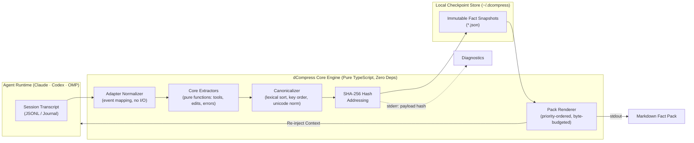

# dcompress

<p align="center">
  <b>Deterministic, rule-based memory for coding agents — no model in the extraction path.</b>
</p>

<p align="center">
  <a href="https://github.com/TomaszGonczar/dcompress/actions/workflows/ci.yml"></a>
  <a href="https://nodejs.org">=20"></a>
  <a href="package.json"></a>
  <a href="LICENSE"></a>
  <a href="docs/SCHEMA.md"></a>
</p>

## TL;DR

`dcompress` turns a coding agent's raw JSONL transcript into a small, verifiable fact pack —
files touched, commands run, errors raised and fixed, decisions stated — with **zero LLM calls
in the extraction path**. Same transcript in, byte-identical pack and SHA-256 hash out, on any
machine, any timezone, any locale — proven in CI, not asserted in prose.

- **704 tests, 0 runtime dependencies, MIT.** `npm test && npm run lint && npm run typecheck`
  all clean on Node 20 and 22, Ubuntu and macOS.
- **Determinism as a release gate.** `test/determinism.spec.ts` re-runs every committed fixture
  under a perturbed clock, locale, and `$HOME`; a non-deterministic payload fails CI, it does not
  ship with a caveat.
- **A real, scored benchmark, not a self-report.** [OG-86](docs/benchmark/og86-medium-v1/) is a
  preregistered, blinded, 3-arm comparison executed against the live Claude API — frozen
  protocol, frozen scoring rubric, checksummed inputs. First complete, valid, checksummed run
  (`n = 1`, directional — see [Benchmarks](#benchmarks) for the full caveat): the dcompact
  checkpoint pack arm recovered **14.5/100** vs **12/100** for native compaction alone and
  **12/100** for the host's own re-surfaced summary. Built and hardened by finding and fixing
  real bugs against real runs rather than mocks (see the commit history under
  `scripts/benchmark/`).
- **Publication gates, not just tests.** Every change is scanned for what it leaks
  (`scripts/privacy-scan.mjs`, working tree *and* history) and proven reproducible from a clean
  clone (`scripts/clean-clone-check.mjs`) before it is considered publishable — both wired into
  CI, both runnable locally in seconds.
- **Honest about what is not done.** The status table below marks continuity/install as
  experimental and Claude-only, MCP and other adapters as not implemented, and secret redaction
  as not yet built. Nothing here is oversold to look finished.

Try it in 60 seconds ⬇, or jump to [How it works](#how-it-works) /
[Determinism](#determinism) / [Benchmarks](#benchmarks).

When a coding agent compacts, it replaces the older half of its own context with a few
paragraphs of model-written prose. `dcompress` takes the opposite approach: it reads the
agent's own transcript with deterministic rules and turns what actually happened — files
touched, commands run, errors raised and fixed, decisions stated — into a bounded,
hash-addressed fact pack that can be verified against the transcript line by line.

## Try it in 60 seconds

Requires **Node 20 or newer** (`package.json` declares `engines.node >= 20`; CI runs 20 and
22) and npm. No account, no network at runtime, no configuration.

```sh
git clone https://github.com/TomaszGonczar/dcompress.git
cd dcompress
npm ci
npm run build
node dist/cli.js preview --transcript test/fixtures/claude/slice-0001/transcript.jsonl
```

The build step is required: nothing generates `dist/` for you, and `npm ci` does not link a
`dcompress` binary into the repository root. Run the CLI through `node dist/cli.js`.

Expected stdout — a Markdown pack, 1696 bytes for this fixture:

```text
## dcompress context [dcompress:1ebd2c27a646]
Status: ok
Facts: 9 | external: 0 | unmapped: 0 | coverage: 1000000 ppm
Source entries: 8 | tool calls: 7
```

and on stderr, the diagnostic report ending in the payload hash:

```text
payload hash: sha256:1ebd2c27a646e226e18229a76828f90e658795c30b8db22f23618777eaba16c4
```

Re-run it under a different timezone, locale, or `$HOME` and the pack and hash are identical.
[`docs/demo/claude-slice-0001.md`](docs/demo/claude-slice-0001.md) holds the full output with
checksums, and `test/demo.spec.ts` fails if that document drifts from what the CLI renders.
[`docs/demo/claude-continuity-0001.md`](docs/demo/claude-continuity-0001.md) is the stronger
artifact: the same kind of run carried across a compaction boundary, with checkpoint, injection,
and merge included.

Useful flags:

```text
node dist/cli.js preview --help
```

- `--include-evidence` appends the transcript line numbers backing each fact.
- `--max-bytes <n>` bounds the pack size (default 16384). A value too small to hold the
  mandatory header is refused with the exact minimum rather than failing internally.
- `--max-facts <n>` caps how many facts are rendered.
- `--json` prints the payload, the payload hash, per-tool-name coverage (which tool names, if
  any, account for a coverage gap), diagnostics, and degraded state as one JSON object, instead
  of the pack and the text report.

To run it against your own session, pass the `transcript_path` that Claude Code hands its
hooks, under `~/.claude/projects/<slug>/<session>.jsonl`. The command **never** scans for a
session or picks the most recent one: if you do not name a transcript, it refuses.

The experimental continuity slice uses the same explicit identity rule and a disposable,
task-owned store. After a Claude `PreCompact` payload is available, checkpoint and restore it:

```sh
node dist/cli.js snapshot --session <session-id> --transcript <path> --store <dir>
node dist/cli.js restore --session <session-id> --store <dir>
```

For a development hook bridge, pipe the Claude hook JSON to the matching command:

```sh
printf '%s\n' '<claude-hook-json>' | node dist/cli.js hook --event precompact --store <dir>
printf '%s\n' '<claude-hook-json>' | node dist/cli.js hook --event session-start --store <dir>
```

The hook fails open with `{}` on malformed input or an unavailable checkpoint. This slice is
Claude-only and task-owned; it does not edit live Claude configuration.

[`docs/demo/claude-continuity-0001.md`](docs/demo/claude-continuity-0001.md) records the whole
loop — checkpoint at the boundary, injection at `SessionStart`, checkpoint after the compaction,
and the merged pack — against a synthetic two-epoch fixture, pinned byte-for-byte by
`test/continuity-demo.spec.ts`. It also documents extraction boundaries: a next action stated in
prose is extracted only when it matches the decision-cue lexicon, `todo.state` keeps a task's text
but not whether it is open or done, and under a reduced byte budget the todo facts are the first
the renderer drops.

## What it does today, and what it does not

| Capability | Status |
|---|---|
| Map a Claude Code JSONL transcript to facts | **Works** |
| Extract `file.modified`, `file.read`, `cmd.run`, `cmd.failed`, `error.raised`, `error.fixed`, `decision.stated`, `todo.state` | **Works** |
| Pair tool calls to their results by ID, over non-adjacent lines | **Works** |
| Count unmapped tool calls and report coverage in parts-per-million | **Works** |
| Deterministic payload and payload hash | **Works** — the same transcript bytes *plus the same extraction inputs* yield the same canonical payload and the same hash, on any machine |
| Refuse rather than guess (no session scanning, no invented `cwd`) | **Works** |
| Byte/fact-budgeted pack with an elision notice | **Works** |
| Explicit-session durable checkpoint store | **Works — experimental Claude-only slice** |
| `restore` / bounded pack for the named session | **Works — experimental Claude-only slice** |
| Claude `PreCompact` / `SessionStart` hook bridge | **Works — Claude only.** `install` writes the real hook command into a live settings file; the checkpoint → compact → resume → inject loop itself is demonstrated only against an explicit session and a synthetic fixture ([`docs/demo/claude-continuity-0001.md`](docs/demo/claude-continuity-0001.md)), not yet inside a real Claude Code session |
| Store: XDG path resolution, atomic snapshot write, hash-verified read, quarantine, manifest, advisory lock, retention | **Works** — `src/store/`, exposed by `list`/`show`/`verify`/`doctor` and written by `prune`/`pin` (retention deletions and the pinned flag); it is a separate format from the continuity checkpoint store above, and no shipped command writes snapshots into it yet (only test code calls `writeSnapshot` directly) |
| `list` / `show` / `verify` / `doctor` (read-only store commands, `--json` supported) | **Works** — `verify --provenance` re-checks facts against the transcript named in the envelope; `doctor` reports the same store's manifest, lock, quarantine, and adapter coverage for one session |
| `prune` / `pin` | **Works** — `prune` applies the existing retention policy (15 snapshots or 72 h, newest and pinned exempt) to one explicitly named session and records each deletion in `manifest.json`; `--dry-run` reports the same set and deletes nothing. `pin`/`--unpin` sets or clears one snapshot's `pinned` flag through the manifest. Both require an explicit `--session`, and `--json` is supported |
| `install` / `uninstall --agent claude` | **Works — Claude only.** Writes or removes dcompress's hook entries in a settings.json inside a byte-marked managed region; every file it edits or creates is backed up first under `<store>/backups/`, and `uninstall` restores it byte-identical (`cmp`-verified in an automated test, D4) or removes a file dcompress created; `--dry-run` prints the plan without writing. Not yet exercised against a real Claude Code session and a real compaction (D2) |
| MCP server | **Not implemented** |
| Codex, OMP, Pi, or any second adapter | **Not implemented** |
| `doctor` | **Works** — reports store, manifest, lock, quarantine, and adapter coverage health for one explicitly named session; `--json` supported |
| `diff`, `init` | **Not implemented** |
| `git.state` facts for Claude | **Not implemented** — the core supports them, the Claude adapter does not emit them |
| Secret redaction | **Not implemented** — planned for the hardening phase |
| npm publish / `npm i -g dcompress` / `npx dcompress` | **Not available** — the package is `private: true` |
| Windows | **Not tested** — CI covers Ubuntu and macOS only |

The continuity commands are intentionally narrow: they require an explicit session, transcript
and/or store path, and support Claude only. A PreCompact starts a new injection epoch even when
the payload hash is unchanged; repeated SessionStart(compact) delivery in that epoch is suppressed,
while every SessionStart(resume) injects because resume is a fresh context. Restore unions degraded
states from the whole verified chain. Facts from earlier checkpoints remain historical and are marked
`unbacked` unless they are present in the newest checkpoint; source counters always describe the
newest input tuple. Since checkpoints are cumulative, continuity merges same-identity numeric attrs
with deterministic max rather than summing them across epochs. `install`/`uninstall` add a
narrower surface of their own — Claude only, and unproven against a live session (see the table
above); general, multi-agent installation and agent discovery still belong to later phases.

## How it works



- The adapter maps record shapes to normalized events. It never reads a clock, the filesystem,
  or the environment, so every value it emits comes from the transcript bytes.
- Extraction is a pure function `(events, config) → facts`. No model, no I/O, no `process.env`;
  a lint rule in the test suite enforces that `src/core/**` cannot import I/O.
- Canonicalization fixes key order, number form, Unicode normalization, and set ordering, so the
  same inputs produce the same bytes.
- The hash covers the canonical **payload only**. Clock, host, and transcript path live in an
  envelope that is not part of the artifact's identity — see
  [`docs/SCHEMA.md`](docs/SCHEMA.md) §6.1.
- The pack orders facts by priority (decisions, then errors and their fixes, then files, then
  commands), retains as many ordered facts as fit, and emits a visible elision notice.

## Determinism

Determinism is the point of the project, so it is enforced rather than asserted:

- **No model.** No LLM call exists anywhere in the extraction path. See
  [`docs/adr/002-rule-based-extraction-no-model.md`](docs/adr/002-rule-based-extraction-no-model.md).
- **Same inputs in, same hash out.** The committed fixture renders to
  `sha256:1ebd2c27a646e226e18229a76828f90e658795c30b8db22f23618777eaba16c4`
  under perturbations of `TZ`, `LANG`, `LC_ALL`, and `$HOME`, on Node 20, 22, and 26. The
  guarantee is over the transcript bytes **and** the declared extraction inputs — repo root,
  `path_base`, extractor version, canonicalization version — not over the transcript alone;
  `docs/SCHEMA.md` §6.1 states the exact scope.
- **Automated regression vectors:** `test/determinism.spec.ts` re-runs every committed fixture under
  perturbed environment, clock, and host inputs; the golden vectors pin exact payload bytes and
  hashes. A non-deterministic payload is a release blocker.

## Privacy

> **Read this before pointing it at a real session.** The facts dcompress prints carry short,
> bounded snippets of transcript text, and **secret redaction is not implemented yet**. Treat a
> generated pack as potentially sensitive: read it before pasting it anywhere. Nothing is
> uploaded — there is no network code in the runtime path — but a pack printed to your terminal
> can still contain a token, a path, or a private note that the transcript happened to contain.
> The bundled demo transcript is synthetic.

### Publishing this repository

Two gates must pass before a checkout of this repository is treated as ready to publish: a scan
for what the commits themselves leak, and a reproduction of the quickstart claim above from a
stranger's position. Passing both is not the same as publishing — this repository is private
(`package.json`'s `private: true` blocks `npm publish`), and the publication pipeline exports a
sanitized `HEAD` into a separate public repository only once the evidence is final and both gates
are green.

#### Privacy and history scan

Every change is scanned before it can be published — the working tree, and the commits the change
adds — by `scripts/privacy-scan.mjs`, which CI runs as its own `privacy` job:

```sh
node scripts/privacy-scan.mjs --json
node scripts/privacy-scan.mjs --history origin/main..HEAD --json
```

It reports host paths, session-id-shaped UUIDs, bearer tokens, API key prefixes, email addresses,
and the user name and host name of the machine it runs on, read at run time so the scan means
something on the machine that wrote the content. A report names the rule, the file, and the line,
never the matched text: a scanner that echoes what it found into a public CI log has published it.
`--history` reads the content commits *added*, because a file deleted in a later commit is still
readable from the repository. `test/privacy-scan.spec.ts` proves that each class is detected, that
the report carries no matched value, and that a secret added and then deleted is still found.

**Gate boundaries:** The scanner checks known secret and path shapes; it is not an automated
redaction engine for generated packs. Each allowlist entry matches one exact literal (such as test
placeholders or local sandbox paths) with a documented reason.

#### Clean-clone reproduction

`scripts/clean-clone-check.mjs` is the other publication gate: it proves the "Try it in 60
seconds" section above is not aspirational. It clones this repository's own `HEAD` into a fresh
temporary directory — never a network fetch — installs from the lockfile and builds with no
inherited `node_modules`, runs the exact command README.md documents, and diffs the resulting
stdout, its byte count, and the stderr payload hash against the values this file states. The
command, the fixture path, the byte count, and the hash are parsed out of the README text itself
rather than hand-copied, so a value that drifts here is exactly what this gate is built to catch:

```sh
node scripts/clean-clone-check.mjs
node scripts/clean-clone-check.mjs --json
```

Exit codes: `0` reproduced, `1` the clone's output, byte count, or hash disagrees with what
README.md claims, `2` a usage error or an internal failure (the clone, install, or build itself
failed, or the README no longer has the shape the parser expects). `test/clean-clone.spec.ts`
unit-tests the parser against synthetic README text and does not itself clone or build; CI runs
the real gate as its own `clean-clone` job, on `ubuntu-latest` only — narrower than the
Ubuntu/macOS test matrix.

**Gate boundaries:** This check verifies one command and its two stated output properties (byte
count and payload hash) against this checkout's git history at `HEAD`. It does not evaluate other
claims or perform network fetches.

Related design decisions:
[ADR 003 — facts, not transcripts](docs/adr/003-facts-not-transcripts.md) (dcompress stores
extracted facts, never conversations) and CONCEPT §9 for the full security model.

## Preview Evaluation & Limitations

The preview evaluates whether rule-based transcript extraction yields facts worth injecting into an agent context:

> **Premise supported, narrowly.** The preview carries information the agent's own compaction
> summary does not: an evidence-backed user decision, a normalized failure signature, an
> explicit error→fix linkage, merged edit history, omitted read and command activity,
> deterministic replay, and visible extraction health. This is enough to justify continuing.

The limitations, stated as plainly as the verdict:

1. The committed fixture is a **small, completed, synthetic task** — 7 tool calls, 9 facts. It
   is not a long real session.
2. **Most of its file changes are git-visible**, so its advantage over `git status` is not yet
   demonstrated at scale.
3. **No unfinished next action is exercised in the preview fixture** — the open-work case a
   post-compaction resume most needs. The continuity demo does carry an unresolved task across a
   compaction, and shows that the pack cannot say it is unresolved.
4. The repository includes an **experimental**, task-owned Claude continuity slice with explicit
   snapshot, restore, and hook commands, plus a Claude-only `install`/`uninstall` with
   byte-identical restore (verified by an automated `cmp` test). Neither replaces a live integration
   test: no recorded session shows a real compaction executing through an installed hook in production.
5. It measures whether the pack is *useful*, not whether injection improves agent outcomes. The
   three-arm continuity-fidelity test is reserved for a later phase
   ([`docs/DEVELOPMENT_PLAN.md`](docs/DEVELOPMENT_PLAN.md) §7.1).

## Roadmap

The design targets a tool that installs into an agent, snapshots automatically at compaction,
and restores a verified pack. This checkout has the experimental explicit-session Claude
continuity slice and a Claude-only `install`/`uninstall` that has not yet been proven against a
real Claude Code session; general, multi-agent installation and the other adapters remain future
work. In wave order:

1. **Wave 1 — done.** Core engine, canonicalization, hashing, 10 golden vectors.
2. **Wave 2 — done.** Adapter recon is complete, the Claude thin slice (`preview`) is
   implemented and judged above, and the store (snapshots, manifest, lock, retention) is
   implemented as a library.
3. **Wave 3 — in progress.** The experimental Claude continuity slice and a Claude-only
   `install`/`uninstall` with reversible, byte-identical restore are in place; verifying the loop
   inside a live Claude Code session during compaction is what remains.
4. **Wave 4.** Adapter framework, then the Codex and OMP adapters, each validated against the
   framework rather than the engine.
5. **Wave 5.** MCP server and the generic fallback tier are not started; a hook
   fault-injection suite (`test/hook-fault-injection.spec.ts`) already verifies recovery ahead of
   remaining hardening work (fuzzing, property tests, budget review), and release remains gated on the other waves.

## Design documents

- [`docs/CONCEPT.md`](docs/CONCEPT.md) — the problem, the architecture, the integration matrix,
  and an explicit list of what dcompress is not.
- [`docs/SCHEMA.md`](docs/SCHEMA.md) — **normative.** The snapshot format and the
  canonicalization rules that make hashes reproducible. If code and this document disagree,
  code is wrong.
- [`docs/DEVELOPMENT_PLAN.md`](docs/DEVELOPMENT_PLAN.md) — phases, wave gates, exit criteria,
  and the bug policy.
- [`docs/ADAPTER-SPEC.md`](docs/ADAPTER-SPEC.md) — per-agent integration contract, with an
  evidence marker on every claim.
- [`docs/adr/`](docs/adr) — the accepted decisions, including rule-based extraction, facts not
  transcripts, determinism as a release gate, and reversible install.

## Benchmarks

[`docs/benchmark/native-compaction-retention.md`](docs/benchmark/native-compaction-retention.md)
is an exploratory note on how much context agents' own compaction retains across repeated
cycles, and how `dcompress preview` compared on synthetic event sets. It is explicitly **not** a
product claim: one session per cell, several cells unmeasurable, `dcompress` never run against
the organic transcripts, and the document states which figures are reproducible and which are
not. Nothing in it runs in CI.

[`docs/benchmark/og86-medium-v1/`](docs/benchmark/og86-medium-v1/) is a materially stronger
claim: a preregistered ([`preregistration.md`](docs/benchmark/og86-medium-v1/preregistration.md)),
blinded, 3-arm comparison executed against the live Claude API rather than a mock, with a frozen
protocol, a frozen scoring rubric, and checksummed inputs (`checksums.sha256`) so the exact
workload and grading criteria are pinned before any arm runs. `scripts/benchmark/run-og86-medium.mjs`
and `run-og86-stage0.mjs` are the real controllers, not illustrative pseudocode: every validity
gate they enforce — model-id pinning, tool-boundary exactness, checkpoint hash re-derivation
through `restore`, treatment-injection accounting, wall-clock and turn ceilings, cost tracking
against a hard runaway limit — was written against, and repeatedly corrected by, real executions
against the live API, not simulated inputs; `test/og86-controller.spec.ts` and
`test/og86-benchmark.spec.ts` cover the controller's stop conditions and the frozen artifact set.
A complete, valid, checksummed 3-arm run exists as of 2026-09-16
([`results/`](docs/benchmark/og86-medium-v1/results/), `run-manifest.json` +
`X1.json`/`X2.json`/`X3.json`, the exact sanitized artifacts the frozen controller emitted — zero
invalidations, zero operational stops, model id and tool boundaries verified every checkpoint).
The question asked: during four controlled manual `/compact` events on the same real coding
workload, does a freshly resumed Haiku 4.5 process recover more useful, verifiable work state
with **(A)** native compacted context alone, **(B)** native context plus the host's own re-surfaced
summary, or **(C)** native context plus a deterministic dcompact checkpoint pack? Cumulative recall
at the fourth and final checkpoint, scored against a 100-point frozen rubric spanning all four
phases:

| Arm | Treatment | Points | Recall |
|---|---|---|---|
| A | native compaction only (control) | 12.0 / 100 | 12.0% |
| B | native compaction + re-surfaced native summary | 12.0 / 100 | 12.0% |
| C | native compaction + dcompact checkpoint pack | 14.5 / 100 | 14.5% |

**Read this as directional evidence, not a population claim** — the preregistration says so in
its first paragraph, and this result does not change that: `n = 1` per arm, one machine, one
model, one workload. C outscored both A and B on this one run; B did not separate from A, meaning
re-surfacing the host's own summary alone showed no measured advantage over doing nothing extra —
only the structured checkpoint pack did. No claim beyond that single, real, checksummed
observation is made here. Real cost for the whole series: $2.04 (Claude CLI's own
`total_cost_usd`, summed per arm — A $0.61, B $0.66, C $0.76); real wall-clock per arm: A 10.9
min, B 12.2 min, C 13.1 min.

## Development

```sh
npm ci
npm test          # vitest: unit, golden vectors, determinism, dependency policy
npm run lint
npm run typecheck
npm run build     # emits dist/, the only shipped surface
```

Golden vectors are regenerated only through `npm run gen:vectors`, which writes `*.actual` for
human review. Never update an expected hash to make a test pass — investigate instead. See
[`AGENTS.md`](AGENTS.md) for the working rules and the ten non-negotiable invariants.

## License

MIT — see [`LICENSE`](LICENSE).
