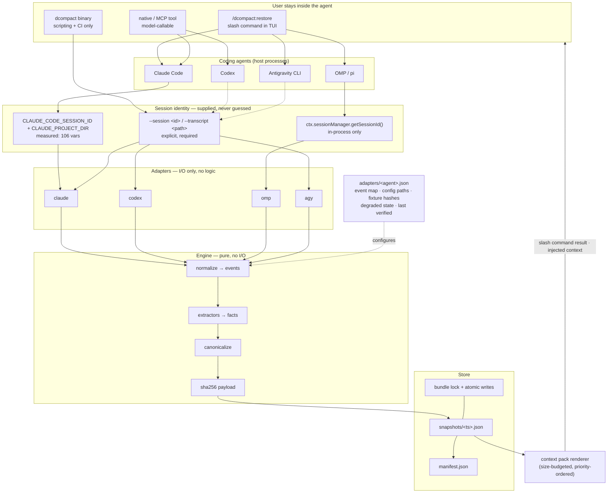

# dcompact — Concept

## 1. Problem

Every coding agent eventually throws away its own working memory.

The mechanism is the same everywhere: when the context window fills, the agent calls a
summarization model over the conversation and replaces the older half with a few
paragraphs of prose. Claude Code ships `/compact`. Codex compacts on overflow. OMP runs a
whole compaction pipeline with methods `remote → snapcompact → handoff → shake → soft`.
Whatever the spelling, the shape is identical:

```
full transcript  ──►  LLM summary  ──►  prose paragraph  ──►  context
   (facts)              (lossy)            (unverifiable)
```

Four failure modes follow, and none of them are hypothetical:

1. **Loss is invisible.** A compaction that dropped the one constraint the user stated
   40 turns ago looks exactly like a compaction that dropped nothing. Nothing reports
   coverage.
2. **Loss is unverifiable.** The summary is model output. You cannot diff it against the
   transcript, and you cannot reproduce it — the same transcript and a different sampling
   give different summaries.
3. **It is not portable.** The summary lives in one agent's session store. Move to another
   agent, or resume the same agent in another checkout, and the context is gone.
4. **Autonomous runs degrade silently.** An overnight agent may compact five times. Each
   pass summarizes the previous summary for the part already summarized. Nobody tracks the
   compounding, and the run can end with the agent confidently working from a stale or
   wrong picture of its own task.

The user's own description of the problem, from the session that produced this document:
*"now when I leave the coding agent — god knows how many times it compacted already and
what was lost in the process."*

## 2. What dcompact is

A **deterministic session continuity tool**. It extracts *facts* from the agent's own
transcript with rules, stores them as content-addressed snapshots, and re-injects a bounded
context pack after compaction or on resume.

```
full transcript  ──►  rule-based extraction  ──►  facts (JSON)  ──►  hash  ──►  context pack
   (facts)              (no model)               (verifiable)      (address)     (facts)
```

Three properties define the product. If a feature weakens one of them, it does not ship.

| Property | Meaning | Why it matters |
|---|---|---|
| **Deterministic** | Same transcript bytes → same snapshot bytes. No model, no timestamps in the hash, no key ordering ambiguity, no locale. | Snapshots can be `verify`d. A change in output means a change in input or in the extractor version — never in a sampler. |
| **Derived** | Every fact carries `path` + `line` into the transcript that produced it, and a snippet hash. | A restore can be audited. If the transcript was truncated or rotated, the fact is marked unbacked, not silently kept. |
| **Reversible** | Every file dcompact edits is backed up and restored byte-identical. Every hook it installs carries a marker. | A tool that rewrites the user's agent config must be able to leave no trace. Uninstall is a first-class command, not a footnote. |

## 3. What dcompact is not

Honest boundaries, because these are the things reviewers and users will ask about:

- **Not an LLM summarizer.** It does not call a model, ever, in the extraction path. A
  "smart" summary mode is explicitly out of scope — that is what the agent's own
  compaction already does badly.
- **Not a server.** No daemon, no port, no account, no telemetry, no network access at all.
  A `dcompact` invocation is a short-lived local process.
- **Not a transcript store.** It keeps extracted facts, not conversations. Snapshots are
  bounded (default 512 KiB serialized). Full transcripts stay where the agent put them.
- **Not an agent.** It never edits source code, never runs project commands, never
  interprets instructions it reads. Transcript content is *data*, never input to act on.
- **Not a quota or credential tool.** It has nothing to do with model accounts, usage, or
  auth.
- **Not a replacement for the agent's compaction.** The agent still compacts; dcompact
  makes what survives the compaction *better*. It runs alongside, at hook points the agent
  already exposes.

## 4. Core insight: the transcript is the fact source, not the summary

The agent's own compaction summary is a bad input. It is prose, it is lossy, and by the
time you read it you cannot tell what it left out. But the agent writes down everything it
did, mechanically, in a structured transcript:

| Agent | Transcript | Layout (verified on this machine) |
|---|---|---|
| Claude Code | `transcript_path` from every hook payload | `~/.claude/projects/<slug>/<session>.jsonl`, one JSON object per line, `{type, message:{role,content[]}, uuid, parentUuid, timestamp, cwd, sessionId, gitBranch, version}` |
| Codex | rollout file per session | `~/.codex/sessions/YYYY/MM/DD/rollout-*.jsonl`, `{timestamp, ordinal, type, payload}` with `type ∈ {session_meta, event_msg, response_item, world_state, turn_context}` |
| OMP | session journal | `~/.omp/agent/sessions/<slug>/<session>.jsonl`, entries `{type: message\|custom_message\|compaction\|branch_summary\|…}` |
| Antigravity CLI | conversation DB | `~/.gemini/antigravity-cli/conversations/<uuid>.db` — **SQLite, no hook surface in `agy --help`; see §7.4** |

Tool calls in those transcripts are structured records: *which* tool, *which* path, *what*
command, *what* error. That is the fact layer. dcompact reads it with rules.

### 4.1 Extracted facts

`v0.1` extractors, all rule-based:

| Kind | Source signal | Determinism note |
|---|---|---|
| `file.modified` / `file.read` / `file.created` / `file.deleted` | **Per-adapter tool→kind map** — see §4.1.1 | Path normalized per SCHEMA §5.2 |
| `cmd.run` | Shell tool input command; success/failure from the tool result's error flag, **not an exit code** — see §4.1.2 | Command text normalized per SCHEMA §5.4 |
| `error.raised` / `error.fixed` | Failed tool result → later success on the same normalized error signature | Signature = normalized message + error class |
| `decision.stated` | user turn first sentence under a decision cue lexicon (`use X instead`, `we will`, `don't`, `always`, `never`, `must`) | Cue match, not interpretation |
| `todo.state` | agent todo/task tool payloads | Last-write-wins |
| `git.state` | `git rev-parse HEAD`, `git status --porcelain`, `git diff --stat` executed by dcompact at snapshot time | Hash of porcelain output, not of the working tree |
| `plan.state` | OMP plan reference / agent plan tool | OMP-only; reported absent elsewhere |

Every extractor is a pure function `(entries, config) → Fact[]` with a golden fixture. No
I/O inside an extractor. That constraint is what makes the hashes reproducible.

#### 4.1.1 Tool names are per-adapter, never universal

An earlier revision of this table named `Write`, `Edit`, `MultiEdit`, `NotebookEdit`,
`Read`, `Bash`, `apply_patch`, `shell` as if they were the vocabulary. They are **Claude
Code's**. Measured against a real OMP journal, the overlap is **zero**:

| Adapter | Actually emitted (measured) |
|---|---|
| **OMP** | `bash` · `read` · `write` · `edit` · `eval` · `todo` · `hub` · `web_search` · `task` · `grep` |
| **Claude Code** | `Bash` · `Read` · `Write` · `Edit` · `MultiEdit` · `NotebookEdit` |

Not one name matches verbatim, and OMP is lowercase where Claude is capitalized. An extractor
written against the table above would extract **zero file facts** on OMP.

**Normative rule: the tool→fact-kind map lives in `adapters/<agent>.json`, per adapter.** The
engine has no built-in vocabulary. A tool name the adapter does not map is a **counted miss**
(`counters.unmapped_tool_calls`), never a silent drop.

Each adapter's map must decide every name its agent can emit. For OMP that means deciding
`eval`, `hub`, `task`, `todo`, `web_search`, `grep` explicitly — mapped to a kind, or declared
ignored with a fixture asserting the ignore. Leaving them undecided is what makes extraction
loss invisible.

This is also why `degraded: extraction-empty` (§11.2) exists: the failure is detected rather
than silent, but detection is not a substitute for the mapping.

#### 4.1.2 There is no exit code — failure comes from the error flag

An earlier revision said `cmd.run` takes "exit status from result". On OMP there is **no exit
code in the transcript**. A bash `toolResult` carries exactly:

```
role · toolCallId · toolName · content · details · isError · timestamp
details = { timeoutSeconds, wallTimeMs }
```

The only failure signal is `isError`, a genuine boolean (verified: every result in a 1,064-entry
journal is `bool`, so there is no `"false"`-as-string trap to defend against). Therefore:

- Success/failure is `isError`.
- `last_error_class` is derived from `isError` **plus the error text**, never from an exit code.
- `timeoutSeconds` / `wallTimeMs` in `details` are available for latency facts if useful.

Claude Code and Codex may expose richer result metadata; that is what per-adapter maps are for.
The engine must not assume any adapter exposes an exit code.

#### 4.1.3 `snippet` comes from the agent, not from guesswork

`snippet` is specified as a short human-readable description of the fact — e.g. *"Edit
src/dispatch.ts — replace retry loop"*. On OMP this needs **no derivation**: the transcript
already carries `toolCall.intent`, a per-call intent string written by the agent.

Measured, verbatim from a live journal:

```
read  → "Listing archaeology output directory"
bash  → "Checking size and file count"
read  → "Reading morning start brief"
```

That is exactly the field's purpose, present deterministically, with no model involved.
`toolCall.id` ↔ `toolResult.toolCallId` pair cleanly (measured 376/376, zero unmatched), so
call/result correlation needs no heuristics either.

Where an adapter exposes an intent field, the extractor **uses it verbatim** (whitespace-
collapsed and capped per SCHEMA §5.4). Where it does not, the extractor synthesizes a minimal
snippet from the fact itself. Adapters must not invent prose — a synthesized snippet is
derived from the fact's own key and attrs, never from interpretation.

### 4.2 What is deliberately not extracted

Conversation prose, assistant reasoning, model opinions, file contents, secrets. dcompact
records *that* a file changed and its blob hash, never the blob.

## 5. Deterministic canonicalization

This is the technical core and the reason the tool is worth building rather than
shell-scripting. The full normative rules live in [`SCHEMA.md`](SCHEMA.md); the contract is:

- JSON canonical form: keys sorted by code point, `\n` only, no trailing whitespace, fixed
  number formatting, UTF-8 NFC, no `undefined`.
- Arrays that are semantically sets (badges, `paths[]`, `evidence[]`) are sorted by a
  documented key and deduplicated before hashing.
- No wall-clock value enters the hashed payload. `created_at` lives in an **envelope**
  outside `payload`; the hash covers `payload` only.
- Host-dependent values (absolute paths, home directory, locale, machine id) are either
  normalized to repo-relative form or excluded from the hash and kept in the envelope.
- The hash is `sha256` over the canonical bytes, and the record stores
  `{schema_version, extractor_version, canonicalization, hash, payload}`.

Two consequences the tests must enforce:

1. `snapshot` twice on the same transcript → byte-identical `payload` and identical `hash`.
2. `snapshot` on a machine with a different `$HOME`, `TZ`, `LANG`, and clock → identical
   `payload` and identical `hash`.

A non-deterministic snapshot is a release blocker, not a bug to triage later.

## 6. Architecture

One engine, thin adapters. All logic lives in the engine; an adapter does four things and
nothing else: locate the transcript, read it, map its entry shapes to a normalized event
stream, and install/remove hook entries in that agent's config format.



Two things this diagram is asserting that earlier versions got wrong:

1. **Invocation enters through the agent**, not through a terminal. The binary exists for CI
   and for agents with no integration; it is last in priority, not first.
2. **Identity is supplied by the agent or by the user, never inferred.** Dotted edges are the
   degraded path: agents whose identity channel is still unverified (Codex, agy) currently
   require an explicit session, and that is acceptable — guessing is not.

### 6.1 Invocation surface — how the user reaches this

**The user is inside their coding agent when they need this.** A bare terminal command is the
worst affordance, not the primary one: it makes them leave the TUI, and it cannot know which
session they mean. See [ADR 001](adr/001-invocation-surface-and-session-identity.md) for the
full decision and the measurements behind it.

Priority order of surfaces, per agent:

| Tier | Surface | User experience | Session identity |
|---|---|---|---|
| **1** | Slash command inside the agent (`/dcompact:restore`) | Never leaves the TUI | From the agent |
| **2** | Tool the model can call (MCP tool / native tool) | Agent invokes it, or user asks in prose | From the agent |
| **3** | Terminal binary (`dcompact snapshot --session <id>`) | Scripting, CI, agents with no integration | Explicit, required |

**`/compact` is never replaced.** dcompact adds a command beside it. The user's existing
compaction behaviour is untouched.

**dcompact never guesses a session.** No "most recent", no "all of them". Unknown session →
exit 2 with the candidate list and the flag to disambiguate. A snapshot of the wrong session
is a plausible-looking artifact about someone else's work, and the user cannot tell.

Verified identity channels:

| Agent | Channel | Identity | Status |
|---|---|---|---|
| Claude Code | MCP server (stdio) | `CLAUDE_CODE_SESSION_ID` → exact transcript path | ✅ measured |
| Claude Code | `~/.claude/commands/*.md` | must be passed as `$ARGUMENTS` | ✅ mechanism verified |
| OMP | in-process extension | `ctx.sessionManager.getSessionId()` | ✅ verified |
| OMP | MCP | **not viable** — only 14 env vars, no session id | ✅ measured |
| Codex | hooks / prompts | unknown | ⚠️ P4 |
| agy | skills / hooks | unknown | ⚠️ P4 |

### 6.2 Command surface

Every command below is reachable three ways: the slash command, the tool, and the binary. The
binary form is shown because it is the one that can be scripted.

| Command | Purpose |
|---|---|
| `dcompact install --agent <name>` | Write hook entries and command files between markers; back up touched files first |
| `dcompact uninstall --agent <name>` | Restore backups; remove markers and its own state |
| `dcompact snapshot [--session <id>] [--full]` | Extract → canonicalize → hash → store; refuses without a session |
| `dcompact list [--json]` | Snapshots for the current session, newest first |
| `dcompact show <id\|latest>` | One snapshot; `--json`, `--payload`, `--envelope`, `--provenance` |
| `dcompact verify [--all\|<id>] [--provenance]` | Recompute hashes; with `--provenance`, re-check every fact against the transcript |
| `dcompact restore [--latest\|<id>] [--format text\|md\|json] [--budget <bytes>]` | Render the context pack |
| `dcompact preview --transcript <path>` | Thin slice: facts → pack on stdout, no store (P6a premise test) |
| `dcompact pin <id>` / `unpin <id>` | Protect a snapshot from retention |
| `dcompact prune [--dry-run]` | Apply the retention policy explicitly |
| `dcompact diff <a> <b>` | Fact-level diff between two snapshots |
| `dcompact doctor [--json]` | Environment, adapter status, hook integrity, drift, budget |
| `dcompact init [dir]` | Optional project-local store (`.dcompact/`) |

Exit codes: `0` success, `1` operational failure, `2` usage, `3` integrity failure
(hash mismatch, provenance broken), `4` degraded but usable. Hooks always exit `0` unless
`--blocking` is explicitly configured, because a hook that fails must never stop the agent.

### 6.2 Storage layout

```
${XDG_DATA_HOME:-~/.local/share}/dcompact/
  sessions/<adapter>-<session_id>/
    snapshots/<utc-iso>-<short-hash>.json
    manifest.json          # ordered index, retention metadata, pins
    lock                   # single-writer lock
  config.json              # retention, budgets, adapter overrides
  logs/                    # opt-in debug log (bounded, off by default)
${XDG_CONFIG_HOME:-~/.config}/dcompact/
  adapters/<agent>.json    # hook entries to install, transcript hints
  backups/<agent>-<ts>/    # pre-install copies of every file we touched
```

Windows: `%LOCALAPPDATA%`/`%APPDATA%` equivalents. macOS: XDG defaults as above (documented,
not silently redirected to `~/Library`).

## 7. Agent integration

The tool is only as good as its hook points. This section states exactly what each agent
supports, verified against docs and against the live installation on this machine, and what
happens where it supports nothing. **Verified** = observed in docs or on disk here.
**Unverified** = must be checked in P4 before any adapter claims support.

### 7.1 Claude Code — full support (verified)

Hooks are JSON entries in `~/.claude/settings.json` (or `.claude/settings.json` per
project), keyed by event, grouped by matcher, with `command`/`http`/`mcp_tool`/`prompt`
handlers. Every hook receives `session_id`, `transcript_path`, `cwd` on stdin.

| Event | Matcher | Use | Control available |
|---|---|---|---|
| `SessionStart` | `startup\|resume\|clear\|compact\|fork` | Inject context pack | `hookSpecificOutput.additionalContext` |
| `PreCompact` | `manual\|auto` | Snapshot *before* history is dropped (the critical one) | can block compaction; `systemMessage`/`continue` discarded |
| `PostCompact` | `manual\|auto` | Snapshot again; receives `compact_summary` | none (side effects only) |
| `SessionEnd` | — | Final snapshot; apply retention | none |
| `Stop` / `SubagentStop` | — | Optional incremental snapshot per turn | `decision: "block"` (not used) |

Verified details that shape the design: `SessionEnd` and `PostCompact` cannot inject
context, so injection must ride `SessionStart` (source `compact` fires after compaction)
and/or `PreCompact`. `SessionStart` with source `resume` reports
`context_tokens`, `prompt_cache_likely_expired`, and `estimated_cache_write_usd`, which
dcompact can surface in `doctor` to show what resuming a stale session costs.

### 7.2 Codex — full support (verified against docs; on-disk trust flow observed)

Hooks live in `~/.codex/hooks.json`, `.codex/hooks.json`, or inline `[hooks]` tables in
`config.toml`. Same three-level shape (event → matcher group → handler). Events include
`SessionStart`, `SessionEnd`, `PreCompact`, `PostCompact`, `UserPromptSubmit`, `Stop`,
`PreToolUse`, `PostToolUse`, `Interrupt`, `SubagentStart`, `SubagentStop`.

Two Codex-specific constraints that are design inputs, not footnotes:

- **Trust review.** Non-managed hooks must be reviewed and trusted; trust is recorded
  against the hook's current hash, so *any edit to the hook command invalidates trust and
  the hook is skipped until re-trusted*. dcompact's installer therefore treats "hook
  installed" and "hook trusted" as separate states and reports the second one in `doctor`.
  The command string must be stable across versions — no timestamps, no version numbers,
  no absolute paths that change per install — or every upgrade silently disables itself.
- **Concurrency and timeouts.** Multiple matching command hooks run concurrently, so a
  dcompact hook cannot assume it is alone. `SessionEnd` and `Interrupt` default to a
  1-second timeout (max 3); other events default to 600. dcompact hooks must return in
  well under 1 second when they synchronously snapshot, or defer the work.

### 7.3 OMP / pi — full support (verified against OMP's own docs)

The richest surface, because OMP extensions are in-process code with a real API, not shell
hooks. A single `dcompact.ts` extension in `~/.omp/agent/extensions/` (or `.omp/extensions/`)
registers:

| Hook | Use |
|---|---|
| `session_before_compact` | Snapshot the pre-compaction branch; can supply `{ cancel }` or a full `{ compaction }` payload |
| `session.compacting` | Contribute `{ context: string[] }` into the compaction summary |
| `session_compact` | Post-compaction notify with the saved entry |
| `context` | Inject the context pack into the LLM message array for a call |
| `tool_call` / `tool_result` | Incremental fact capture without waiting for compaction |
| `session_start` / `session_shutdown` | Load and flush state |

Plus `pi.registerCommand("dcompact", …)` for `/dcompact` inside OMP, and the branch reader
`ctx.sessionManager.getBranch()` for journal access.

**OMP's real entry model (measured, not assumed).** An earlier revision declared the
normalization target as `message` / `custom_message` / `compaction` / `branch_summary`. The
actual journal contained:

```
message(672) · custom(376) · custom_message(5) · model_change(3)
thinking_level_change(3) · title_change(2) · title(1) · session(1) · compaction(1)
```

Two consequences:

- **`custom` is 35% of the journal** — all `customType: tool_execution_start` — and was
  unaccounted for. It duplicates a `message` signal, so it is not fatal, but the adapter must
  **declare it explicitly ignored** with a fixture asserting the ignore, rather than leaving
  it undefined. The same applies to the five metadata types (`model_change`,
  `thinking_level_change`, `title`, `title_change`, `session`).
- **`branch_summary` does not exist by default** (`branchSummary.enabled = false`). It must be
  handled defensively, not assumed present.

Verified correct from the earlier revision: `role: "toolResult"` in camelCase, not
`tool_result`. That detail is load-bearing — a filter comparing snake_case matches nothing and
silently drops every tool result.

#### 7.3.1 OMP can be a compaction method, not a post-compaction patch

This is the highest-value adapter-specific upgrade available, and it is inconsistent with §8 as
written. `§8` says *"Never inject on `PreCompact` (the payload would be summarized away)"* —
that reasoning is **Claude-derived and does not generalize to OMP**, where the hook surface is
richer:

| OMP hook | Capability | What dcompact can do with it |
|---|---|---|
| `session_before_compact` | Supply a **full `{ compaction: CompactionResult }`**, or `{ cancel }` | Register as a first-class **`compaction.methodOrder` entry** — a deterministic compaction method |
| `session.compacting` | Contribute `{ context: string[] }` **into** the summary | Facts land *inside* the summary the model actually reads |
| `context` | Inject into the LLM message array | The §8 plan covers only this one |

`session.compacting` is not injection *before* summarization — it is a **contribution to** the
summary. That is strictly better than injecting after, and it means dcompact's continuity can
be *through* compaction rather than *recovered after* it.

**Adapter requirement:** the OMP adapter MUST register `session.compacting` to contribute the
pack into the summary, and SHOULD offer the `{ compaction }` method registration behind a
config flag (it changes the agent's compaction behaviour, so it is opt-in and reversible,
consistent with invariant 5). For agents without this surface, §8's post-compaction injection
remains the mechanism.

`useless` also exists as a flag on OMP tool results — the same concept as OMP's own
`dropUseless` elision, and a signal dcompact can use rather than derive.

OMP also *imports* other agents' commands (`~/.claude/commands`, `~/.codex/commands`,
`~/.config/opencode/commands`, `.agents/commands`), which means a single OMP setup can
serve several agents' command surfaces. Worth exploiting in P11; not required for v0.1.

### 7.4 Antigravity CLI — full support (corrected: hooks exist)

**Correction to an earlier claim in this document.** An earlier revision stated that `agy`
"exposes no hook surface" based on `agy --help`, which lists only flags and the `agent`,
`mcp`, `plugin`, `models`, `remote-control`, `update` subcommands. That inference was wrong.
Hooks are configured through `settings.json` under the `hooks` key, and the binary carries a
full lifecycle-hook implementation.

Evidence:

- `~/.gemini/antigravity-cli/settings.json` already contains a live `hooks` object with a
  `SessionStart` entry using a `matcher` and a `type: "command"` handler — the same
  three-level shape Claude Code and Codex use.
- `agy` (v1.2.2, 180 MB binary) contains these symbols: `hooks_go_proto.CallHookRequest`,
  `CallHookResponse`, `CommandHook`, `HookHandlerConfig`, `HookSystemMessage`,
  `HookInjectedStep`, `HookUserMessage`, `HookToolCall`, `SessionStartHookArgs/Result`,
  `PreToolHookArgs/Result`, `PostToolHookArgs/Result`, `OnToolErrorArgs/Result`,
  `StopHookArgs/Result`, and **`OnCompactionArgs`**.
- The lifecycle enum is present verbatim: `LIFECYCLE_HOOK_ON_COMPACTION`,
  `ON_SESSION_START`, `ON_SESSION_END`, `ON_TOOL_ERROR`, `PRE_TOOL`, `POST_TOOL`,
  `PRE_TURN`, `POST_TURN`, `STOP` (+ `UNSPECIFIED`).

So `agy` is a **full-support adapter**, not a degraded one. `OnCompaction` is the `PreCompact`
equivalent and is the event that matters most.

Also available (all verified): `agy mcp add|remove|list|enable|disable` (stdio and http), and
`agy plugin` subcommands including `import [source]` — documented as importing plugins from
**gemini or claude**, which means an agent-plugin format can carry hooks across agents.
`--print-interactive`, `--mode`, `--sandbox`, `--output-format stream-json` remain available.

Still unverified, and therefore a P4 task: the exact `settings.json` hook schema (event
names as written by a user, handler fields, matcher semantics), whether a hook can inject
context, and whether hooks fire in `--print` (headless) mode. Conversations persist as SQLite
under `~/.gemini/antigravity-cli/conversations/`, which is now only a *fallback* fact source,
not the primary one.

### 7.5 MCP — the portable pull tier (any MCP-capable agent)

Hooks are proprietary per agent. MCP is the only cross-agent standard in this space, and it
is the difference between supporting three agents and supporting most of them.

| Mechanism | Agents | Direction | Guarantee |
|---|---|---|---|
| **Native hooks** | Claude, Codex, OMP, agy | **Push** — harness injects context at the event | Snapshot always taken; pack always injected, whether or not the model cooperates |
| **MCP server** | Claude, Codex, OMP, agy, Cursor, Windsurf, VS Code, Gemini CLI, OpenCode | **Pull** — the model or user calls a tool | Recall on demand only |

**MCP cannot replace hooks, and the plan must not pretend otherwise.** An MCP tool fires only
when something *chooses* to call it. An unattended agent that has already lost context does
not know it has forgotten anything, so it will not call `dcompact_restore` on its own. Push
is the continuity mechanism; pull is a recovery and inspection mechanism.

What MCP does buy, cheaply:

- **Reach.** One stdio server definition reaches nine agents. `mcpServers` is the same JSON
  shape in Claude Code, Cursor, Windsurf, and standalone `.mcp.json`; OMP additionally reads
  `.mcp.json` and `mcp.json` at the project root, and translates every other agent's native
  MCP config on discovery.
- **Inspection without a TUI.** `dcompact_restore`, `dcompact_list`, `dcompact_verify`,
  `dcompact_diff` become callable from the editor, so a user can ask "what did I do before
  the compaction?" in an agent that has no hook support.
- **A `/dcompact` slash-command surface** in every agent that exposes MCP prompts.

Server shape: **stdio**, no network, `npx -y dcompact mcp` or the resolved local binary. The
server reuses the engine directly — no new extraction code, no IPC protocol to design.

Tools exposed (v1): `dcompact_restore` (bounded pack, same renderer and budget as the CLI),
`dcompact_list`, `dcompact_show`, `dcompact_verify`, `dcompact_diff`.

Honest labelling: `doctor --json` reports `tier: "hooks"` or `tier: "mcp-only"` per agent.
An MCP-only agent must never be described as having continuity.

### 7.6 Everything else — honest fallback

The tool still works without any integration, because the fact source need not come from a
hook: `dcompact snapshot --from <transcript>` accepts a transcript path directly, and
`dcompact restore` prints a pack a human can paste. For agents with neither hooks nor
readable transcripts, `dcompact` degrades to a git/workspace tracker
(`git.state` + file-mtime facts) with no error and no pretence of parity. The capability
matrix in `doctor --json` is the contract: it tells the user what tier they are on.

**Note on the Pi family.** `pi` (pi-mono) is the upstream project; OMP (`@oh-my-pi`) is a fork
that tracks it via periodic `git format-patch` syncs, and the two have documented divergences
(UI architecture, component naming, auth storage, extension manifest key `pkg.pi` vs `pkg.omp`,
`vitest` vs `bun:test`, hook vs extension naming). The OMP adapter must therefore be written
against the documented OMP surface, with the shared parts isolated so a future `pi` adapter is
a small mapper rather than a rewrite. Do not assume Pi compatibility — verify it in P4.

### 7.7 Install model (all agents)

```
1. detect    → read target config, locate existing dcompact markers
2. backup    → byte copy to backups/<agent>-<ts>/ with a recorded sha256 per file
3. render    → hook entries from adapters/<agent>.json, wrapped in markers:
               "# >>> dcompact >>>" … "# <<< dcompact <<<"
4. write     → atomic (temp file + rename), preserving file mode
5. verify    → re-read, parse, assert markers present and JSON/TOML valid
6. report    → backup path, trust requirement, degraded subsystems
```

Rules: never rewrite a file whose parse fails; never touch a file outside the adapter's
declared list; never install into a project-scoped config unless `--project` is given;
`uninstall` restores from the recorded backup and refuses if the file changed outside the
marker block (reporting the conflict instead of clobbering user edits). Multiple hosts do
not coexist in one store — that is the multi-lane problem, and the answer is separate
stores, not shared state.

## 8. Injection model

Injection is bounded, ordered, and formatted for a model to read, not for a human.

Pack format (default `md`, ~600 tokens, hard byte budget):

```
[dcompact] session <id> · snapshot <id> · <n> facts · <k> from transcript
FILES (7 modified, 4 read)
  M src/dispatch.ts          ← 3 edits, last after "retry loop" decision
  R migrations/0042.sql
COMMANDS (12)  failures: 3
  ✗ pytest tests/test_dispatch.py → 2 failed (connection reset) → fixed
DECISIONS
  - "use bounded retry, not infinite backoff"
GIT  HEAD 4f2a1c9 · 7 dirty · +214/−38
OPEN  todo 2/5 · plan: wire adapter registry
```

Rules:

- Facts are ordered by priority (errors and decisions first, then files, then commands),
  then by recency, then by a stable tiebreak — so two runs produce the same pack.
- Facts marked `unbacked` (transcript rotated or truncated) are shown with an explicit
  marker, never silently dropped.
- Over budget → drop whole fact groups from the bottom of the priority order, emit
  `… (n facts elided, run dcompact show <id>)`.
- Injection is idempotent: repeated injection of the same snapshot is detected by marker
  `[dcompact:<hash>]` in the injected text, and re-injection is skipped.
- Injection point is **adapter-specific, and the choice matters more than the payload**:

  | Adapter | Injection point | Effect |
  |---|---|---|
  | **OMP** | `session.compacting` → contributes into the summary; optionally register as a `{ compaction }` method | Facts are inside what the model reads — continuity *through* compaction |
  | **Claude Code** | `SessionStart(source=compact\|resume).additionalContext` | Injected after compaction |
  | **Codex** | `SessionStart` (confirm in P4) | Injected after compaction |
  | **agy** | `OnCompaction` if it injects (verify) | Unknown |

  dcompact must **not** inject on Claude's `PreCompact`: the payload would be summarized away.
  That reasoning does not transfer to OMP, where `session.compacting` contributes *into* the
  summary rather than preceding it. Applying one agent's constraint to another is how a
  design loses the better mechanism (CONCEPT §7.3.1).
- Nothing is ever injected that the user has not had a chance to read: `restore` prints the
  exact bytes.

## 9. Security & privacy

- **No network.** No HTTP client in the dependency tree for the runtime path. A CI check
  asserts it (dependency allowlist + no `net`/`http`/`fetch` imports in the core).
- **No silent path loss — this was the worst defect found in review.** An earlier revision
  scoped facts to a single `repo_root`: paths outside it were excluded, only *counted*. Measured
  against a real OMP session (`repo_root = ~/Omega-v3`):

  ```
  file ops inside repo_root:    9
  file ops OUTSIDE:           124   (93.2%)   ← excluded under the old rule
    omega-component-prep  69 · other 38 · Desktop 9 · xd:// 4 · /tmp 3 · ~/.omp 1
  ```

  **93% of that session's file facts would have been dropped**, while `coverage` still read
  high — because coverage counted *tool calls mapped*, not *paths retained*. The loss was
  invisible in the pack header.

  The old rule was wrong on three counts, each now fixed:

  1. **`repo_root` is the wrong scoping primitive.** An agent that touches a sibling
     workspace, a scratch directory, or a second repo loses most of its facts. Real agents do
     this constantly.
  2. **The `path_base: "cwd"` fallback did not help**, because it only triggered when cwd was
     *not* a repo. Here it was, so the strict exclusion applied.
  3. **`xd://` targets are not filesystem paths at all** (4 in that session) and no rule
     covered them.

  **New rule:** a snapshot has a **scope set** of roots, not one root. Out-of-scope paths are
  retained as facts, tagged with their scope, and counted in `counters.external_path_count`.
  A path is excluded from the payload *only* when it is outside every scope root **and** the
  adapter is configured to exclude — never by default.

  The scope set is discovered, not declared: repo roots for each touched git worktree, plus
  the session cwd, plus any directory the agent was granted via `--add-dir` or equivalent.

- **Counts are surfaced, not buried.** `external_path_count`, `unmapped_tool_calls`, and
  `coverage_ppm` appear in the **pack header**, not only in `doctor`. A user must be able to
  see at injection time that extraction lost something. A number visible only in a debug
  command is a number nobody reads.
- **Non-filesystem targets get a kind, not a drop.** `xd://`, `skill://`, and similar
  internal device URIs are recorded as facts with a `uri` scheme tag rather than discarded or
  mistaken for paths. They are evidence of work performed.
- **No transcript written back into injected context.** Injection carries only normalized
  facts and short quoted snippets under a fixed character cap.
- **Untrusted input.** Transcript content is data. dcompact never executes, evaluates,
  interpolates into a shell, or follows instructions found in it. Path-shaped and
  command-shaped strings are validated (`isSafeRelativePath`, `isSafeCommandText`) before
  display, and control characters are stripped so a fact cannot forge pack structure.
- **Injection cannot escalate.** The pack is inserted as context text; it cannot add tools,
  change permissions, or call anything.
- **Secrets.** A redaction pass runs over fact snippets with a conservative pattern set
  (private keys, bearer tokens, `*_KEY=`-style assignments, long base64/hex runs), and
  `--no-redaction` is opt-in with a warning.
- **Local only.** No sync, no sharing, no upload. A snapshot is a file the user owns;
  `rm -rf` of the store is a complete deletion.
- **Least surprise.** Install prints every file it will touch before touching it, and
  `--dry-run` prints without writing.

## 10. Retention

Policy from the product requirements: **15 snapshots or 72 hours, whichever comes first.**

- Evaluated on `snapshot`, on `prune`, and on `SessionEnd` — never inside a hook that
  blocks a turn.
- Pinned snapshots are exempt.
- The newest snapshot is never pruned, even if a clock jump makes it look old.
- Pruning is recorded in `manifest.json` (id, reason, timestamp) so a user can see what
  was deleted and when.
- `--dry-run` on every command that can delete.

## 11. Collateral and bug policy

The product will have bugs. Most of them will be *environment* bugs — a new agent version, a
moved config path, a changed transcript layout — and the worst outcome is not a wrong
snapshot, it is a *silently* wrong snapshot or a *broken agent*. Both are designed against
explicitly.

### 11.1 The four guarantees

| Guarantee | Mechanism |
|---|---|
| dcompact never breaks an agent | Hooks exit `0` on any internal error; every hook body is wrapped; a hard wall-clock budget (default 400 ms for synchronous hook work) aborts extraction and reports degraded |
| dcompact never corrupts user config | Backup before edit, atomic writes, marker-scoped edits, refuse-on-conflict, `uninstall` restores byte-identical (byte-compare is a test) |
| dcompact never silently extracts nothing | Adapters declare an expected shape; zero facts extracted from a non-empty transcript raises `degraded: extraction-empty` and says so in `doctor` and in the injected pack header |
| dcompact never silently mis-extracts | Golden fixture per adapter with a recorded transcript hash; fixture hash mismatch → adapter marked `schema-drift`, extraction continues but every snapshot from that adapter is stamped `degraded: schema-drift` until a human updates the fixture |

### 11.2 Degraded states (first-class, not error strings)

`ok` · `degraded: schema-drift` · `degraded: extraction-empty` · `degraded: provenance-broken`
· `degraded: budget-exceeded` · `unavailable: agent-not-installed` · `untrusted: hook-pending-review`

Every state is serializable, testable, and visible in `doctor --json` and in the pack
header. A user must never have to infer that the tool is operating in a reduced mode.

### 11.3 Bug classes and required responses

| Class | Example | Detection | Containment | Recovery |
|---|---|---|---|---|
| Extraction miss | New tool name not mapped → file edits not recorded | Coverage counter: tool calls seen vs facts emitted; ratio drop raises degraded | Extraction continues, miss is counted | Extractor patch + fixture |
| Extraction false positive | Shell heredoc parsed as a file path | Fixture + `verify --provenance` | Fact marked unbacked | Normalizer patch |
| Hook breakage | Agent changes hook schema; hook stops firing | `doctor` heartbeat: last-successful-hook timestamp per adapter | Hook exits 0, logs locally | Adapter definition update + version stamp |
| Trust invalidation | Codex re-trusts required after an edit | `doctor` reads trust state where exposed | Reported as `untrusted` | Stable hook command string; documented `/hooks` step |
| Corrupt snapshot | Truncated write, power loss | Hash mismatch on read | Snapshot quarantined, never injected | Prune the bad file; `verify --all` |
| Store race | Two agents snapshot the same session concurrently | Lock file with pid + mtime, stale-lock break | Second writer waits ≤1 s then writes a distinct snapshot | Atomic rename guarantees one winner |
| Injection bloat | Pack exceeds budget on a huge session | Byte budget enforced before write | Groups dropped bottom-up, elision notice | Budget config |
| Retention over-delete | Clock jump, DST, VM resume | Newest-never-pruned rule; pins; dry-run | Deletions logged with reason | Restore from backup if pinned; document irreversibility |
| Install corruption | User edits inside the marker block | Marker-scoped restore + conflict refusal | Refuse and report | Manual merge; `uninstall --force` after backup |

### 11.4 Determinism as collateral

Determinism is fragile under exactly the changes that break extraction. Rules:

- Every nondeterministic input is injected, never read globally: clock, `$HOME`, cwd,
  locale, git HEAD. Tests pass all of them explicitly.
- The canonicalization version is stored in every snapshot. Changing it is a schema event,
  not a patch: `SCHEMA.md` gets a version bump, and `verify` on an old snapshot reports
  `schema-older` rather than a false hash mismatch.
- Extractor version is stored separately from schema version, so an extractor improvement
  invalidates provenance checks while leaving schema compatibility intact.
- A `determinism` test suite re-runs extraction on every fixture with perturbed
  environment (`TZ`, `LANG`, `HOME`, cwd, injected clock) and asserts identical hashes on
  each supported platform in CI.

### 11.5 Versioning and drift

- `adapters/<agent>.json` carries `last_verified_version` and `verified_at`. `doctor`
  compares the detected agent version and warns on mismatch.
- The adapter file is user-editable and validated against a JSON Schema, so a broken agent
  update can be fixed without waiting for a release.
- CI runs the fixture suite against every supported agent version in the matrix; a matrix
  row going red is a release blocker, not a warning.

### 11.6 Concurrency and crash safety

Single writer per session store via `lock` (`{pid, host, started_at}`). Writes are
`write temp → fsync → rename`. A crash leaves either the old snapshot or the new one,
never a partial file. `manifest.json` is rebuilt from the snapshot directory when it
disagrees with reality, and the rebuild is reported in `doctor`.

## 12. Non-goals for v0.1

Session forking, multi-machine sync, a GUI, a TUI dashboard, agent-to-agent handoff,
embedding-based search, snapshot compression/encryption, Windows-first support, any feature
that calls a model.

(The earlier list included "agy hook install (impossible)" — that was wrong. `agy` has
lifecycle hooks including `OnCompaction`, verified in the binary and in live
`settings.json`. See §7.4.)

## 13. Decisions taken and open questions

### Resolved

1. **macOS storage** → XDG on every platform with a `DCOMPACT_HOME` override. Settled in
   [ADR 008](adr/008-storage-location.md) during OG-55.
2. **`PreCompact` may block; dcompact never blocks** → **deliberate tradeoff, not an open
   question.** Blocking would be the only way to *guarantee* a pre-compaction snapshot on
   Claude Code. We accept the weaker guarantee because failing an agent's compaction is a
   worse outcome than missing one snapshot — invariant 6 (a hook never fails its host)
   outranks completeness of the record. The consequence is stated plainly: on Claude Code,
   dcompact can miss a snapshot if compaction is triggered and the hook is unavailable; on
   OMP, `session.compacting` closes this gap because it contributes into the summary rather
   than racing it (§7.3.1). Recorded as an accepted limitation, and surfaced in `doctor` as
   `degraded: no-pre-compaction-hook` where it applies.

### Open

3. **Redaction default:** on by default, or off with a first-run prompt?
4. **Project-scoped stores:** is `.dcompact/` worth it in v0.1, or is user-scoped only enough?
5. **agy hook schema:** the events exist and `OnCompaction` is present in the binary, but the
   user-facing `settings.json` schema and whether hooks fire in `--print` (headless) mode are
   unverified. Headless is the mode an autonomous run uses, so this decides push vs pull for agy.
6. **Scope-set discovery:** how eagerly is the scope set built? Touching a new root mid-session
   must add it, and a root that vanished must not invalidate the snapshot. Needs a rule, not an
   implementation detail.
